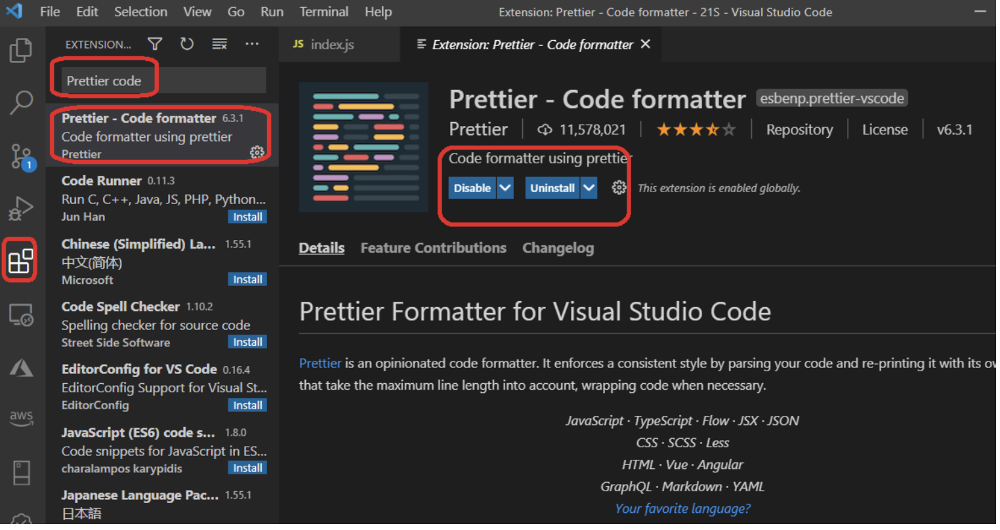

 In Lab 1, the goal is to install and set up your personal computer with the necessary software tools required for CIT281! This lab also focuses on practicing the use of software tools. 

I learned to work with various programs which included the following: 
-VSCode which supports extensions that enhance its features and capabilities. I also learned how to add some extensions, including Prettier - Code formatter, ESLint, and GitHub Pull Requests and Issues. 

-Node.js is another important tool I learned to use for server-side JavaScript development. 
-Git, a version control system, is necessary for tracking and managing code changes. Download and install Git from the Git website.
-Postman is a tool used for testing server-side rules which I also downloaded. 

After installing the necessary software tools I reviewed VSCode tips and tricks, set the default JavaScript code formatter, and practiced using the terminal commands in VSCode. 
 
 

 

